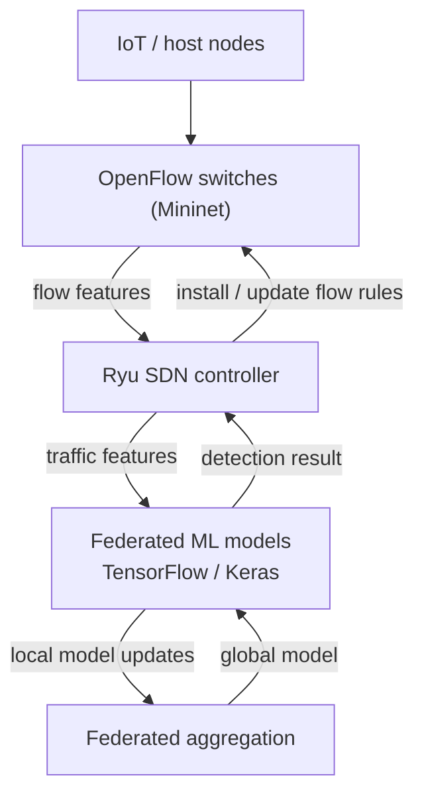

# Federated Learning IDS/IPS over SDN IoT Test Bed

> Final Year Project — Bachelor of Computer & Networking Engineering Technology, Canadian University of Dubai (2026)


A distributed **Intrusion Detection and Prevention System (IDS/IPS)** that combines **federated learning** with **Software Defined Networking (SDN)** to detect and respond to network attacks across an IoT test bed in real time — without centralising raw traffic.

## Overview

- Integrated **SDN controllers** with **machine-learning models** for real-time threat detection and automated prevention.
- Used a **federated-learning** approach so detection models train across distributed nodes while keeping local data local.
- Evaluated **performance, scalability, and detection accuracy** across multiple network environments.
- Conducted **analysis of network attacks** and the automated detection/response mechanisms triggered by the controller.

## Architecture



The controller collects flow features from the emulated data plane, the federated models classify traffic, and detections are pushed back to the controller, which installs or updates OpenFlow rules to prevent malicious flows.

## Tech Stack

| Area | Tools |
| --- | --- |
| SDN | Ryu Controller, OpenFlow, Mininet |
| Machine Learning | Python, TensorFlow, Keras, Federated Learning |
| Evaluation | Attack scenarios, detection-accuracy & scalability analysis |

## Repository Layout (planned)

```text
controller/     Ryu application: feature collection + rule installation
models/         federated-learning training and aggregation
topology/       Mininet IoT test-bed definitions
evaluation/     attack scenarios, metrics, and results
docs/           report and architecture notes
```

## Status

This repository documents the project. The implementation code, evaluation results, and the final report will be added here.

## License

Released under the [MIT License](LICENSE).

## Author

**Dana Hammad** — [LinkedIn](https://www.linkedin.com/in/dana-hammad-00a277350) · Dubai, UAE
